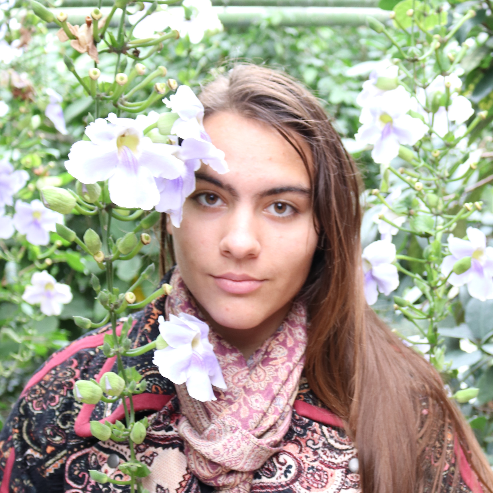

# Sonja Huč 
Preloge 53, 1211 Ljubljana – Šmartno  
Date of birth: 22. 11. 1997

<a href="sonja.huc@gmail.com">sonja.huc@gmail.com</a>
| +386 40 577 047

## Education

`2016 - present`
- Biotechnical faculty, University of Ljubljana  
Bachelor degree programme: Biology (final year)

`2012 - 2016`
- Škofijska klasična gimnazija  
prejemnica Zoisove štipendije

## Delovne izkušnje

`18. – 28. 7. 2018`
- Biology Students Research Camp  
Biological Student's Society Ljubljana, Slovenia
Mentor of the Marine Mollusk group: organizing field work, collection and/or photography, identification, cleaning, and storing of specimens.  
Reference:Katarina Lenarčič ([katarina.lenarcic@gmail.com](katarina.lenarcic@gmail.com))

`30. 6. 2018`
- Marine Mollusk Field Day  
Biological Student's Society Ljubljana, Slovenia 
Mentor: preparation and execution of the field day, collection and/or photography, identification and storing of specimens.  
Reference: Domen Kocjan ([kocjan_domen@hotmail.com](kocjan_domen@hotmail.com))

`Poletje 2010 `
- Poletni herpetološki tabor za otroke  
Friends School of Wilmington, Wilmington, NC, ZDA  
Pomočnica voditeljice poletnega herpetološkega tabora za otroke
stare 3 – 6 let: razlaganje o živalih, rokovanje s kačami, animiranje otrok, priprava malic  
Referenca: Karen Smith Linehan ([karenl@fsow.org](karenl@fsow.org))

## Materni jeziki

- slovenščina
- angleščina

## Drugi jeziki

| Jezik      | Slušno razumevanje | Bralno razumevanje | Govorno sporazumevanje | Govorno sporočanje | Pisno sporočanje    |
| :--------: | :----------------: | :----------------: | :--------------------: | :----------------: | :-----------------: |
| angleščina | Native speaker     | Native speaker     | Native speaker         | Native speaker     | Native speaker      |
| nemščina   | B1                 | B2                 | B1                     | B1                 | A2                  |
| španščina  | B1                 | B2                 | A2                     | A2                 | B1                  |
| latinščina | A1                 | A2                 | A1                     | A1                 | A1                  |

## Vozniško dovoljenje

- AM, B1, B, G ~ Lasten prevoz

## Strokovne izkušnje

- Urejanje spletne strani za lastno zbirko malakološke favne www.sonja.si
- Poletna šola biologije v Kostariki pod vodstvom dr. Toma Turka (2018)
- Video snemanje transekta koralnega grebena na Mauritiusu (2019)
- Sodelovanje z Muzejem školjk (referenca: Jan Simič, email: jan.simic86@gmail.com)

## Strokovne kompetence

- Terensko delo iz malakologije, botanike, herpetologije, mikologije ter vodnih in kopenskih nevretenčarjev
- Izdelava herbarija
- Delo v (bio)kemijskem, mikrobiološkem, genetskem, fiziološkem laboratoriju
- Vzgoja sadik

## Računalniške kompetence

| Programska oprema     | Nivo znanja | Programska oprema     | Nivo znanja |
| --------------------- | ----------- | --------------------- | ----------- |
| Microsoft Word        | dobro       | Gimp                  | dobro       |
| Microsoft Power Point | zelo dobro  | Adobe InDesign        | osnovno     |
| Microsoft Excel       | osnovno     | R                     | osnovno     |
| Linux ukazna vrstica  | dobro       | Cockos Reaper         | dobro       |
| PyMOL                 | osnovno     | VMD                   | osnovno     |

## Ostale lastnosti in kompetence

- Vztrajnost
- Sposobnost samostojnega dela
- Sposobnost timskega dela
- Sposobnost natančnega upoštevanja navodil/protokola
- Samoiniciativnost
- Izrazit čut za pravičnost in poštenost
- Želja in pripravljenost za nadaljnje izobraževanje
- Prevajanje iz slovenščine v angleščino
- Zanimanje za in osnovno znanje bioinformatike

## Aktivnosti v prostem času

- Glasba: solo petje, kitara, violončelo, pisanje in snemanje skladb v okviru dueta
- Narava: potapljanje na dah z namenom raziskovanja morja, vrtnarjenje, gobarjenje
- Teraristika: *Pantherophis guttatus*, *Boa constrictor imperator*
- Fotografija narave, podvodna in popotniška fotografija
- Risanje, slikanje, likovno ustvarjanje, šivanje oblačil
- Kuhanje omak iz doma vzgojenih čilijev (več kot 100 sort), peka in krašenje tort

<!-- ### Footer

Last updated: Aug 2019 -->

